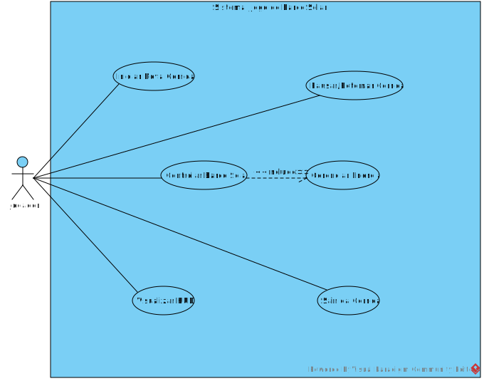

# Análise orientada a objeto
> [!NOTE]
> A **análise** orientada a objeto consiste na descrição do problema a ser tratado, duas primeiras etapas da tabela abaixo, a definição de casos de uso e a definição do domínio do problema.

## Descrição Geral do domínio do problema

> [!NOTE]
>Descrever de forma geral o domínio do problema.

O projeto é um jogo de corrida de barcos solares com visão de cima para baixo (*top-down*). O jogador controla um barco e compete contra oponentes em diferentes pistas. A mecânica central do jogo gira em torno do gerenciamento de energia: acelerar consome a bateria, que por sua vez é recarregada pela exposição à luz solar. O jogador deve, portanto, equilibrar velocidade com estratégia de posicionamento para vencer a corrida.

Para a estruturação dos passos futuros, foram decididas as [especificações](especificacoes.md) iniciais das pistas do jogo.

> [!NOTE]
>Possíveis requisitos funcionais e não-funcionais podem ser elencados aqui.
> **Requisitos Funcionais:**
> - O jogador deve poder controlar o barco (acelerar, frear, virar).
> - A bateria do barco deve diminuir com a aceleração.
> - A bateria do barco deve recarregar sob a luz do sol.
> - O jogo deve ter um sistema de checkpoints e contagem de voltas.
> - O jogo deve declarar um vencedor ao final da corrida.
>
> **Requisitos Não-Funcionais:**
> - O jogo deve rodar a uma taxa de quadros suave (ex: 60 FPS).
> - A interface gráfica deve ser intuitiva, mostrando velocidade e nível de bateria.

## Diagrama de Casos de Uso

> [!NOTE]
>Apresentar o diagram de casos de uso, identificando as funcionalidades do sistema assim como os atores envolvidos

    

O diagrama apresenta como ator o **Jogador**. As principais funcionalidades que ele pode invocar são: **Iniciar Nova Corrida**, **Controlar Barco Solar**, **Pausar/Retomar a Corrida** e **Sair da Corrida**. A ação de  inerentemente  a necessidade de , pois toda movimentação afeta o consumo ou ganho de bateria, sendo a mecânica principal do jogo. O jogador também pode  (velocímetro, bateria, etc.) durante a partida.
 
## Diagrama de Domínio do problema

> [!NOTE]
>Elaborar um diagrama conceitual do domínio do problema.

[Retroceder](README.md) | [Avançar](projeto.md)

