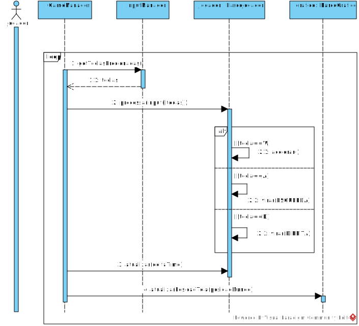

# Projeto orientado a objeto

>[!NOTE]
>O **Projeto orientado a objeto** é composto pelas documentação do projeto descrito em UML. Deve incluir um Diagrama de Classes do sistema projetado, e pelo menos um diagrama de interação de um dos casos de uso. Outros diagramas podem ser apresentados, caso julgue necessário.

Para o projeto, foi desenvolvido o diagrama de classes abaixo, que modela a solução do problema. O diagrama foi estruturado com foco na **Separação de Responsabilidades**:

* **Modelo (Lógica):** Classes como `BarcoSolar`, `Pista`, `Checkpoint` e `GameManager` cuidam da lógica do jogo (física, regras, estado da corrida) em um mundo 2D (`Ponto2D`).
* **Visão (Gráficos):** Classes como `GameObjectGrafico` e `BarcoGrafico` cuidam da renderização (o "como desenhar"), convertendo a lógica do mundo para a visão isométrica na tela (com o `QGraphicsScene`).

Este design demonstra **Herança**, **Agregação** e **Polimorfismo**.

    

Para exemplificar como esses objetos colaboram, o diagrama de sequência abaixo detalha o caso de uso **"Controlar Barco Solar"**, desde o input do jogador até a atualização da lógica e dos gráficos.

    

[Retroceder](analise.md) | [Avançar](implementacao.md)

